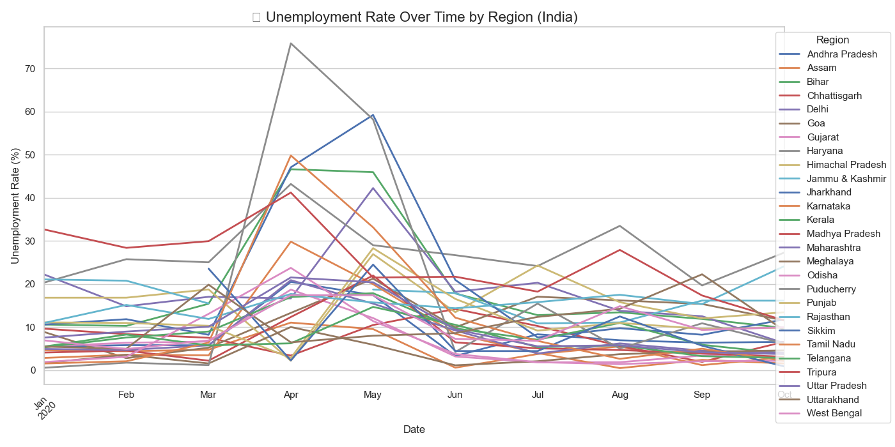

# 📊 Task 01 – Unemployment Analysis

This is the first task of the Data Science Internship at **Oasis Infobyte**.

## 📌 Problem Statement

Unemployment is measured by the unemployment rate, which is the number of people who are unemployed as a percentage of the total labor force. During the COVID-19 pandemic, the unemployment rate in India saw a sharp increase.

This project aims to analyze and visualize unemployment trends across different regions of India using Python and real-world data.

---

## 📁 Dataset Used

- **Name:** Unemployment in India
- **Source:** [Kaggle - Unemployment in India](https://www.kaggle.com/datasets/gokulrajkmv/unemployment-in-india)
- **File:** `Unemployment_Rate_upto_11_2020.csv`

---

## 🔧 Technologies Used

- Python 3
- Pandas
- Matplotlib
- Seaborn
- Jupyter Notebook / VS Code

---

## 📈 What I Did

- Loaded and explored the unemployment dataset
- Converted date column to proper datetime format
- Cleaned column names
- Plotted:
  - Line chart showing unemployment trends by region over time
  - Bar chart showing average unemployment rate by region

---

## 📊 Output Graphs

### 🔹 Unemployment Trend Over Time

---

## 📌 Conclusion

The unemployment rate in India spiked significantly during the early months of the COVID-19 pandemic in 2020. This analysis shows that the rate varied by region and fluctuated over time, with some areas being more severely affected than others.

---

## 👨‍💻 Submitted By

**Aryan Pathak**  
Data Science Intern – Oasis Infobyte  
