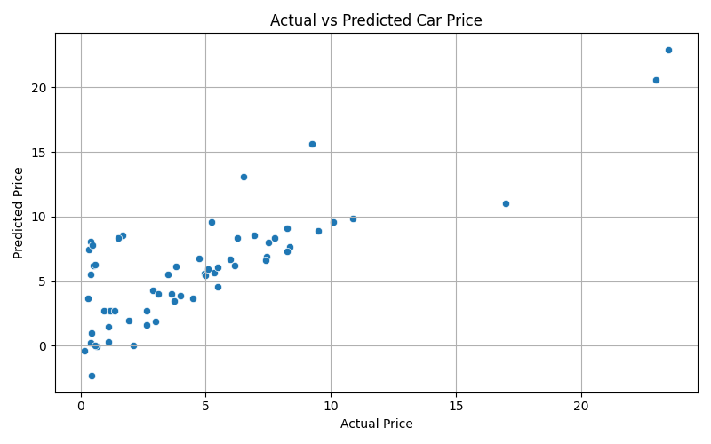

# Task-3: Car Price Prediction (Used Cars)

This project is part of the Data Science Internship at **Oasis Infobyte**.

## 📌 Objective

The goal is to build a machine learning model that can predict the **selling price of a used car** based on various features like year, fuel type, seller type, transmission, and kilometers driven.

## 📁 Dataset

- Source: [Kaggle - Car price prediction (used cars)](https://www.kaggle.com/datasets/vijayaadithyanvg/car-price-predictionused-cars)
- File used: `car data.csv`

## 🧪 Libraries Used

- pandas
- matplotlib
- seaborn
- scikit-learn

## 🧠 Machine Learning Model

- **Model Used:** Linear Regression
- **Target Variable:** `Selling_Price`
- **Features:** Year, Present_Price, Kms_Driven, Fuel_Type, Seller_Type, Transmission, Owner

## 📊 Output

### 🔹 R² Score:
The model achieved an R² score of approximately: `X.XX`  
(Replace this with your actual score from terminal output)

### 🔹 Actual vs Predicted Plot:


## 📝 How to Run

```bash
pip install pandas matplotlib seaborn scikit-learn
python car_price_prediction.py
