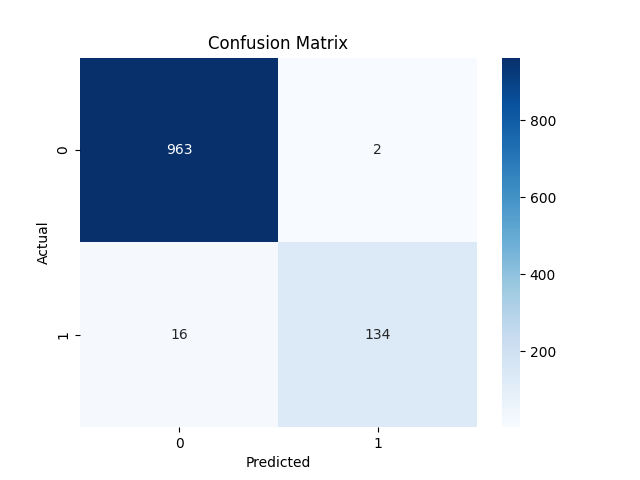

# 📧 Task 4 - Email Spam Detection with Machine Learning

This project is part of the **Oasis Infobyte Data Science Internship**.

## 📌 Objective

The goal is to build a machine learning model in Python to detect whether an email is **spam** or **not spam** (ham). The dataset contains labeled email texts which we use to train and evaluate the model.

---

## 🧠 Technologies Used

- Python 🐍
- Pandas
- Scikit-learn
- Matplotlib
- Seaborn

---

## 📂 Dataset

The dataset `spam.csv` contains two main columns:

- `v1`: Label (ham or spam)
- `v2`: The actual email text

📥 [Dataset Source](#) *(or link to Kaggle if available)*

---

## 🛠️ Steps Performed

1. **Loaded the dataset** using pandas.
2. **Preprocessed the data** by renaming columns and encoding labels.
3. **Vectorized** the text using `CountVectorizer`.
4. **Trained** a Naive Bayes classifier on the data.
5. **Evaluated** the model using accuracy score and confusion matrix.

---

## ✅ Output

📊 **Confusion Matrix**:




✅ Accuracy: **~98.4%**

---

## 📎 How to Run

1. Clone or download this repo.
2. Place `spam.csv` in the root folder.
3. Run:
```bash
python spam_detection.py

